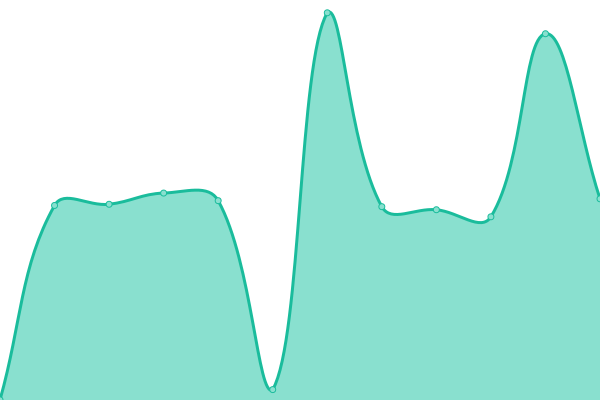

# [📈 Live Status](https://status.imoyv.com): <!--live status--> **🟩 All systems operational**

<!--start: status pages-->
<!-- This summary is generated by Upptime (https://github.com/upptime/upptime) -->
<!-- Do not edit this manually, your changes will be overwritten -->
<!-- prettier-ignore -->
| URL | Status | History | Response Time | Uptime |
| --- | ------ | ------- | ------------- | ------ |
|  [bw.imoyv.com](https://bw.imoyv.com) | 🟩 Up | [bw-imoyv-com.yml](https://github.com/11vyo/status/commits/HEAD/history/bw-imoyv-com.yml) | 

 1112ms
     
 | 

<a href="https://status.imoyv.com/history/bw-imoyv-com">97.07%</a>
    

|  [cloud.imoyv.com](https://cloud.imoyv.com) | 🟩 Up | [cloud-imoyv-com.yml](https://github.com/11vyo/status/commits/HEAD/history/cloud-imoyv-com.yml) | 

 1506ms
     
 | 

<a href="https://status.imoyv.com/history/cloud-imoyv-com">97.27%</a>
    

|  [code.imoyv.com](https://code.imoyv.com) | 🟩 Up | [code-imoyv-com.yml](https://github.com/11vyo/status/commits/HEAD/history/code-imoyv-com.yml) | 

 1362ms
     
 | 

<a href="https://status.imoyv.com/history/code-imoyv-com">97.27%</a>
    

|  [drop.imoyv.com](https://drop.imoyv.com) | 🟩 Up | [drop-imoyv-com.yml](https://github.com/11vyo/status/commits/HEAD/history/drop-imoyv-com.yml) | 

 882ms
     
 | 

<a href="https://status.imoyv.com/history/drop-imoyv-com">97.26%</a>
    

|  [ssh.imoyv.com](https://ssh.imoyv.com) | 🟩 Up | [ssh-imoyv-com.yml](https://github.com/11vyo/status/commits/HEAD/history/ssh-imoyv-com.yml) | 

 776ms
     
 | 

<a href="https://status.imoyv.com/history/ssh-imoyv-com">100.00%</a>
    

|  [imoyv.com](https://imoyv.com) | 🟩 Up | [imoyv-com.yml](https://github.com/11vyo/status/commits/HEAD/history/imoyv-com.yml) | 

 1760ms
     
 | 

<a href="https://status.imoyv.com/history/imoyv-com">96.67%</a>
    

<!--end: status pages-->
